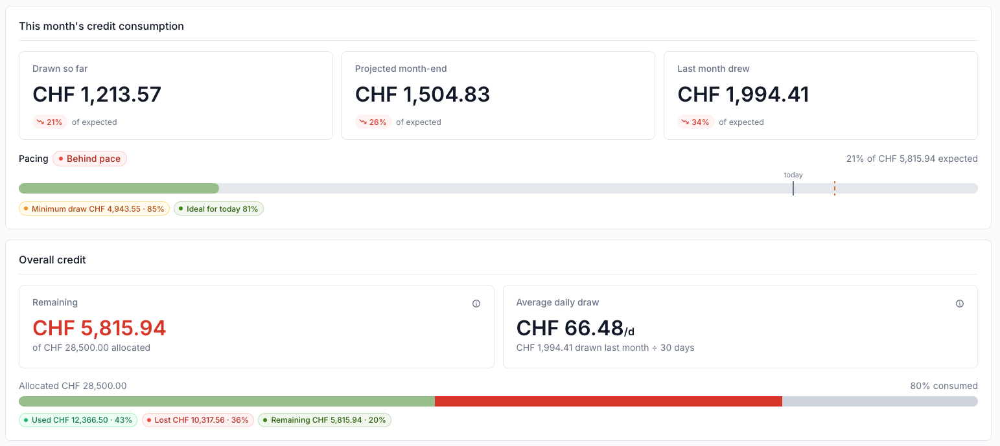

<!-- _class: divider -->

<span class="tag">Module 1 · ~10 min</span>

# Project lifecycle and access

Getting a project, adding your team, managing its resources, and watching the budget.

<div class="split">

**Mostly for PIs and deputies** — getting a project, the team, the resources, the budget.
**Everyone** — the two kinds of account, the inference API, what you have spent.

</div>

<!--
START AT T+05:00. Check the presenter timer now.
CUT IF LATE: Cut "What a Swiss AI project comes with" — the inference slide carries the point.

- This module is twelve minutes. It is the plumbing part.
- The interesting part of the hour is modules 2 and 3.
- Most of it is for PIs and deputy PIs: getting a project, adding people, the resources, the budget.
- Four slides are for everybody: the two kinds of account, the inference API, and where to see what you spent.
- Each slide says in the top right corner which one it is.
- So if the admin part is not your job, you have a few minutes to read your email. I will not be offended.
- Accounts, MFA and SSH keys are not on any slide. They are all on the handout. Take one.
- And please interrupt me. Ask when the question comes to you, not at the end.
- Let us start at the beginning. How do you get a project at all?
-->

---
<!-- _footer: 'Alps technical training · Swiss AI Initiative Annual Meeting 2026 · docs.cscs.ch/platforms/mlp/' -->
<div class="audience">PIs and deputies</div>

# Small and large are two different processes

You choose which one to apply for. The Swiss AI Initiative decides. CSCS opens the project and runs it.

<div class="cols-wide">
<div>

|  | Small | Large |
|---|---|---|
| Typical budget | up to 32,000 GPUh | 500,000 GPUh and up |
| Duration | 6 months | 12 months |
| Review | rolling | two calls a year |
| Start | first day of the next month | 1 January or 1 July |
| Storage | 1 TB, 1M inodes by default | must be in the proposal |

</div>
<div class="card">

### Before asking for a large one

- GPU hours you **measured**
- The efficiency you expect
- The **data footprint**, and how long it stays

A weak large proposal is usually **made smaller**, not rejected.

</div>
</div>

<div class="accent">

The 4th call for large projects is open right now — **3 August to 14 September 2026**. `swiss-ai.org/compute-grants`

</div>

<!--
- First, who does what. You choose small or large, and you apply to the Swiss AI Initiative, not to us.
- They decide. We open the project and run it.
- Small: up to thirty-two thousand GPU hours, six months, reviewed all year. You can start next month.
- Large: five hundred thousand and up, twelve months. It starts only on the first of January or the first of July.
- Miss a call and you wait six months.
- The storage row is the one people forget. Small gets a terabyte by default. Large gets none — you state it in the proposal.
- Bring three things to a large proposal: GPU hours you measured, the efficiency you expect, and your data footprint.
- And a weak large proposal is usually made smaller, not rejected.
- The fourth call closes on the fourteenth of September. That is about three weeks.
- Next: you have a project. What is an account?
DOCS: docs.cscs.ch/platforms/mlp/ · swiss-ai.org/compute-grants
-->

<!-- TODO(verify): the small/large policy numbers come from the MLP policies page,
which is still a docs preview at cscs-docs-preview.svc.cscs.ch/463/platforms/mlp/policies/
and is being merged into docs.cscs.ch in the coming days. Swap the footer link and the
"Where to read more" entry to the final docs.cscs.ch URL before the session, and
re-check the numbers at that point. The call dates come from swiss-ai.org, not from
CSCS — re-check them the week before, they change per call. -->

---
<!-- _footer: 'Alps technical training · Swiss AI Initiative Annual Meeting 2026 · docs.cscs.ch/accounts/' -->
<div class="audience all">Everyone</div>

# Your user account lives as long as one project does

There are two kinds of account here. This one is a **person**, and it can sit in several projects.

<div class="cols">
<div>

### Three roles

- **Project administrator** — the PI
- **Project manager** — the deputy PI
- **Project member** — everyone else

Administrators and managers **invite people** and **assign roles**.

</div>
<div class="card">

### One user account, many projects

- **Institutional address only**, and always the **same one**
- Open while **at least one** project is open
- It closes with the **last** project you are on
- A later invitation **re-enables** the same account

</div>
</div>

<div class="accent">

Your email address **is** your identity. A different address gives you a **second account**, not access to your first.

</div>

<!--
- Three words the portal uses. Project administrator is the PI, project manager is the deputy, project member is everyone else.
- Only the first two invite people and set roles.
- Now the important part, and I will say it slowly.
- Your email address is your identity. One address, one account, and institutional addresses only.
- Always use the same one. A different address does not get you back into your old account. It gives you a second one.
- If you have changed institution, or you were invited on a different address, talk to us. Do not just accept with the new one.
- A user account can belong to several projects, and stays open while one of them is open.
- It closes with the last project you are on. What happens at a project end date comes later, with the budget.
- Good news: a later invitation switches the same account back on.
- Next: that is an account with a person behind it. There is a second kind without one.
DOCS: docs.cscs.ch/accounts/
-->

<!-- TODO(verify): docs.cscs.ch/accounts/ backs only the middle of this card — "accounts
are bound to projects, and accounts will be closed with the project unless the account
is also part of another open project". The two ends do not appear there: that the email
address is the unique identity, and that a later invitation re-enables the same account
rather than creating a new one. Both come from Andrea as ML Platform service manager.
Confirm, then get them written into the docs page. -->

---
<!-- _footer: 'Alps technical training · Swiss AI Initiative Annual Meeting 2026 · docs.cscs.ch/accounts/account-create/' -->
<div class="audience all">Everyone</div>

# A service account runs the work you are not there for

Your own account is for the work you do yourself. Automation needs a different kind.

<div class="cols">
<div>

- A **user account** is a person — interactive work, and it can sit in several projects
- A **service account** runs a workload **on behalf of** a person — pipelines, scheduled jobs, anything unattended
- It is **bound to one project** and inherits its validity period — project ends, account closed
- Normally **run by the project team**, with a **shared team address** for its notifications

</div>
<div class="card">

### How to get one

Not enabled by default. The **PI** opens a Service Desk ticket explaining the use case: what it is for, expected usage, who is responsible, and for how long.

Once approved, a **Service Account** entry appears under **Team** in the portal — the tab we open next.

</div>
</div>

<div class="accent">

Its own username, and an **API key** instead of a password. No MFA — it does not log in like a person.

</div>

<!--
- One more kind of account, and it is the one people improvise badly.
- A service account runs work on behalf of a person: a pipeline, a scheduled job, anything that runs when nobody is watching.
- It belongs to one project only, and it closes automatically when that project ends.
- In practice the team runs it together, on a shared team address, so the notifications reach the team and not one inbox nobody reads after that person leaves.
- It is not enabled by default. The PI opens a Service Desk ticket: what for, how much, who is responsible, for how long.
- Then a Service Account entry appears under Team in the portal.
- The red line is the part people picture wrongly. It has its own username and no password. It authenticates with an API key.
- And it has no multi-factor, because it never logs in the way you do.
- If you used a secondary account before, this is what replaces it.
- Next: that Team tab is worth a look, so let us open the portal.
DOCS: docs.cscs.ch/accounts/account-create/
-->

<!-- Sourced from Ceriani et al., "Transitioning User and Identity Management for Alps",
CUG 2026, sections 4, 4.1 and 5.2 — on-behalf-of, single-project binding, inherited
validity period, automatic deprovisioning and the accountability argument are all stated
there. The paper's scope-restriction sentence is deliberately NOT on the slide: it describes
the architecture, and whether a PI can request a narrower scope today is unsettled.
Confirmed by Andrea as ML Platform service manager on 25 August 2026, and NOT in any
document: that service accounts are off until requested; that the project team runs the
account and registers it on a shared team address; and that it authenticates with an API
key under its own username, with no MFA. These are facts, not guesses — but a reader of
docs.cscs.ch cannot find any of them, which is a documentation gap rather than an open
question. Listed in notes/docs-gaps.md. -->
---
<!-- _footer: 'Alps technical training · Swiss AI Initiative Annual Meeting 2026 · docs.cscs.ch/accounts/' -->
<div class="audience">PIs and deputies</div>

# The portal is where the project lives

`portal.cscs.ch` — your team, your resources, and what they have spent.

<div class="cols-narrow">
<div>

- Log in with MFA, then pick your **organisation** and your **project**
- **Project dashboard** — the credit, and what it has spent
- **Resources** — what the project was granted, and where a PI adds **inference**
- **Team** — who is on the project. **Invitations** beside it takes one address, or a **CSV** for a whole cohort
- **Audit logs** — what changed, and who changed it

</div>
<div class="screenshot">


</div>
</div>

<!--
- If you are a PI and you have never opened this, the next few minutes are the ones to stay awake for.
- Log in with the same account as every other CSCS web application, then pick your organisation and your project.
- The header gives you the two dates that matter: when the project started and when it ends.
- Then four tabs, and most PIs have seen none of them.
- Project dashboard is the credit and what you have spent. There is a slide on that shortly.
- Resources is what the project was granted, and where you add an inference resource.
- Team is who is on the project. Look at the roles column.
- Inviting is one email address and a role, or a CSV when ten students arrive in September.
- If they already have a CSCS account they accept and they are in. If they are new, the invitation sends them to account creation.
- Audit logs is the record of what changed and who changed it.
- Next: the team is on the project. What does the project actually give them?
DOCS: docs.cscs.ch/accounts/
-->

<!-- Screenshot captured 25 August 2026 from the test project grtest3. The email column is
deliberately blurred: those are real colleagues and this deck is published to a public
GitHub Pages site. To use the unblurred capture, re-crop the original without the
GaussianBlur paste — see the commit that added this file.

TODO(verify): whether, and by whom, an existing member's role can be changed after the
invitation is not documented anywhere — the portal docs cover only the invitation flow.
Andrea's expectation is that a PI and a deputy PI can both do it from the Team tab. Click
it, then either put one line on this slide or get it into the docs page.

TODO(verify): the tab names are read straight off the capture, which is why the old
"Invitations" and "Usage" bullets are gone — neither is a tab. What is NOT verified is
what "Project dashboard" and "Audit logs" contain; the descriptions above are inferred
from their names and from where the consumption panels most likely live. Click both and
correct the two bullets. -->

---
<!-- _footer: 'Alps technical training · Swiss AI Initiative Annual Meeting 2026 · docs.cscs.ch/platforms/mlp/' -->
<div class="audience">PIs and deputies</div>

# What a Swiss AI project comes with

Compute and storage arrive with the project. One more resource is opt-in.

<div class="cols">
<div>

### By default

- **Compute** on **Clariden** and **Bristen**
- **Project storage** — `/store`, shared by the whole project

### On request

- **Inference** — an API resource the **PI or deputy** adds in the portal

</div>
<div class="card">

### They all draw on one credit

There is no separate inference budget you can overspend independently.

It is **one project credit**, and everything spends it.

</div>
</div>

<div class="accent">

The next slide is the one nobody expects: you can use a model without running a job at all.

</div>

<!--
- A quick inventory, because most people do not know what they already have.
- By default your project gets compute on both clusters, Clariden and Bristen.
- And it gets project storage, the store area, which the whole project shares.
- Your home directory and your scratch are yours, not the project's. Module 2 covers those.
- One thing is opt-in: an inference resource. The PI or the deputy adds it in the portal.
- These are not separate pots. There is one project credit and everything spends it.
- Next: the one nobody expects — you can use a model without running a job at all.
DOCS: docs.cscs.ch/platforms/mlp/
-->
---
<!-- _footer: 'Alps technical training · Swiss AI Initiative Annual Meeting 2026 · docs.cscs.ch/services/inference/api/' -->
<div class="audience all">Everyone</div>

# You can use a model without training one

`api.inference.cscs.ch/v1` — **new since 24 July**, OpenAI and Anthropic compatible. Change a base URL and your code works.

<div class="cols-wide">
<div class="code-sm">

- Open-weight models, served and managed for you — **Apertus 70B** and **8B**, among others
- The **PI or deputy PI** creates the inference resource in `portal.cscs.ch`; then **any project member** can create API keys
- Each key can carry a token budget — but **any member can make another key**

```bash
curl -X POST https://api.inference.cscs.ch/v1/chat/completions \
  -H "Authorization: Bearer $CSCS_INFERENCE_API_KEY" \
  -d '{"model": "swiss-ai/Apertus-70B-Instruct-2509", "messages": [...]}'
```

</div>
<div class="card">

### It is not free, it is yours

> "The credit for the inference resource is taken from your project's credit."

**There is no project-level cap.** To get one, the PI opens a Service Desk ticket.

</div>
</div>

<div class="accent">

The docs also show how to point **Claude Code** and **OpenCode** at it.

</div>

<!--
- This is new. It has been there since the twenty-fourth of July.
- A managed inference API. Open-weight models, served for you.
- It is OpenAI and Anthropic compatible, so change the base URL and your code works.
- And it serves Apertus, which is your own model.
- The PI or the deputy adds the resource in the portal. Then any member creates API keys.
- Let me read the quotation. The credit comes out of your project credit.
- And a budget on one key does not cap the project, because any member can make another key.
- Today there is no project-level cap. If you want one, that is a Service Desk ticket.
- Look at the curl. Three lines. If you know the OpenAI API, you already know this.
- Next: how you see what you have spent.
DOCS: docs.cscs.ch/services/inference/api/
-->

<!-- TODO(verify): model names and pricing move. Re-check the model list and the
"Available models and pricing" section the week before the session, and confirm the
Apertus tag swiss-ai/Apertus-70B-Instruct-2509 is still current if you quote it. -->

---
<!-- _footer: 'Alps technical training · Swiss AI Initiative Annual Meeting 2026 · docs.cscs.ch/accounts/' -->
<div class="audience all">Everyone</div>

# Check the consumption regularly

New since **24 August 2026**: two panels for the project, and a third view per resource.

<div class="cols-narrow">
<div>

- **This month** — drawn so far, projected month-end, and whether you are on pace
- **Overall credit** — allocated, used, **lost**, remaining
- **Per resource** — open one for the usage **per user** inside it

</div>
<div class="screenshot">



</div>
</div>

<div class="accent">

Every member of the project sees this, not only the PI.

</div>

<!--
- This changed two days ago, so even people who use the portal every week have not seen it.
- Two new panels. The first is the month you are in: drawn so far, where the month is projected to end, what last month drew.
- The pacing bar under it tells you in one look whether you are ahead or behind for today.
- The second is the whole credit. Allocated, used, lost, remaining, and your average daily draw.
- Lost is the word to look at. That is credit that was never spent and is not coming back.
- The third view is not in this picture. Open a single resource and you get the usage per user inside it.
- And everyone on the project sees all of this, not only the PI.
- We know these views were not good enough. This is the first part of fixing that.
- Next: why regularly, and not just at the end.
DOCS: docs.cscs.ch/accounts/
-->

<!-- TODO(verify): the consumption view is not documented on
docs.cscs.ch/accounts/waldur/ at all, and these two panels shipped on 24 August 2026, so
nothing describes them yet. Both the panels and the visibility rule come from Andrea as
ML Platform service manager. Get them into the docs page — see notes/docs-gaps.md. -->

---
<!-- _footer: 'Alps technical training · Swiss AI Initiative Annual Meeting 2026 · docs.cscs.ch/platforms/mlp/' -->
<div class="audience">PIs and deputies</div>

# Spend it linearly, or you lose it

Every project gets a credit in GPU hours, spent as your jobs run. Each month has an expected amount, and a minimal you must not fall below.

<!-- The <div> wrapper is load-bearing: CommonMark only treats a whitelisted set of tag
     names as HTML blocks, and <svg> is not one of them, so an unwrapped diagram is
     parsed as inline HTML and its text nodes are flattened into a paragraph. Keep the
     whole block free of blank lines, which would close the HTML block early. -->
<div class="diagram">
<svg viewBox="0 0 1160 320" width="100%" role="img"
     aria-label="Top: three example months of usage as bars against two thresholds, an expected line and a minimal line below it separated by the grace. Above expected is fine, in between rolls over, below the minimal the gap is lost. Bottom: the project timeline, 6 or 12 months, then compute stops, then a 90-day grace period in which the project stays active for data retrieval only, then it closes.">
  <g font-family="Inter, sans-serif">
    <!-- ── row 1: the monthly rule ───────────────────────────────────────── -->
    <text x="90" y="20" font-size="13" font-weight="600" fill="#888888" letter-spacing="0.6">IN ANY GIVEN MONTH</text>
    <!-- your usage -->
    <rect x="140" y="52"  width="100" height="128" fill="#9A9AA0"/>
    <rect x="320" y="90"  width="100" height="90"  fill="#9A9AA0"/>
    <rect x="500" y="148" width="100" height="32"  fill="#9A9AA0"/>
    <!-- the credit burned by falling short -->
    <rect x="500" y="112" width="100" height="36" fill="#F3E0E1" stroke="#D61F26" stroke-width="1.5" stroke-dasharray="4 3"/>
    <text x="550" y="136" font-size="13" font-weight="600" fill="#D61F26" text-anchor="middle">lost</text>
    <!-- thresholds -->
    <line x1="100" y1="70"  x2="800" y2="70"  stroke="#D61F26" stroke-width="2"   stroke-dasharray="7 5"/>
    <line x1="100" y1="112" x2="800" y2="112" stroke="#D61F26" stroke-width="1.5" stroke-dasharray="3 4"/>
    <line x1="100" y1="180" x2="820" y2="180" stroke="#E5E5E5" stroke-width="2"/>
    <text x="810" y="75"  font-size="15" font-weight="600" fill="#D61F26">expected</text>
    <text x="810" y="117" font-size="15" font-weight="600" fill="#D61F26">minimal</text>
    <!-- the grace between the two -->
    <line x1="990" y1="70" x2="990" y2="112" stroke="#D61F26" stroke-width="1.5"/>
    <line x1="984" y1="70" x2="996" y2="70"  stroke="#D61F26" stroke-width="1.5"/>
    <line x1="984" y1="112" x2="996" y2="112" stroke="#D61F26" stroke-width="1.5"/>
    <text x="1006" y="86"  font-size="13" font-weight="600" fill="#D61F26">grace</text>
    <text x="1006" y="104" font-size="12" fill="#555555">15–50%, by budget size</text>
    <!-- what each case means -->
    <g text-anchor="middle" fill="#1A1A1A">
      <text x="190" y="202" font-size="14" font-weight="600">you go faster</text>
      <text x="190" y="220" font-size="12" fill="#555555">fine — lower priority while ahead</text>
      <text x="370" y="202" font-size="14" font-weight="600">you go slower</text>
      <text x="370" y="220" font-size="12" fill="#555555">the rest rolls over</text>
      <text x="550" y="202" font-size="14" font-weight="600">you fall below</text>
      <text x="550" y="220" font-size="12" fill="#555555">that credit is gone</text>
    </g>
    <!-- ── row 2: the project timeline ───────────────────────────────────── -->
    <line x1="90" y1="240" x2="1140" y2="240" stroke="#F0F0F0" stroke-width="1"/>
    <text x="90" y="262" font-size="13" font-weight="600" fill="#888888" letter-spacing="0.6">OVER THE WHOLE PROJECT</text>
    <line x1="380" y1="288" x2="870" y2="288" stroke="#9A9AA0" stroke-width="5"/>
    <line x1="870" y1="288" x2="1060" y2="288" stroke="#D61F26" stroke-width="5"/>
    <line x1="870" y1="274" x2="870" y2="302" stroke="#1A1A1A" stroke-width="2"/>
    <line x1="1060" y1="278" x2="1060" y2="298" stroke="#1A1A1A" stroke-width="2"/>
    <text x="625" y="310" font-size="13" fill="#555555" text-anchor="middle">6 or 12 months</text>
    <text x="870" y="264" font-size="14" font-weight="600" text-anchor="middle">compute stops</text>
    <text x="965" y="310" font-size="13" font-weight="600" fill="#D61F26" text-anchor="middle">90 days grace — data only</text>
    <text x="1074" y="293" font-size="13" fill="#555555">closes</text>
  </g>
</svg>
</div>

<div class="accent">

Out of credit before the end? The `low` partition, capped at two months of your budget.
All the rules: **docs.cscs.ch/platforms/mlp/**

</div>

<!--
- This is the most useful slide for a PI, so I will not rush it.
- Your project has a credit in GPU hours. You spend it as your jobs run, roughly evenly, month by month.
- Every month has two numbers. Expected is what you should use. Minimal is that minus a grace of fifteen to fifty per cent, depending on your budget size.
- Left bar: you used more than expected. Fine — you just run at lower priority while you are ahead.
- Middle: you used less but stayed above the minimal, so the rest rolls over.
- Right: you fell below it, and the red box is credit that does not come back.
- Then the timeline. Six or twelve months, the end date stops your compute, and the project stays active ninety more days for data only.
- Out of credit early? The low partition, about two months of your budget.
- Every number here is on that one page. Take a photo of it.
- One last thing, and it is not on the slide. Burning the budget on schedule and getting nothing out of it is worse than under-consuming.
- We would rather you used less and knew why, than hit every monthly target with jobs that taught you nothing.
- Next: that is the project, start to finish. Here is where to read the detail.
DOCS: docs.cscs.ch/platforms/mlp/policies/
-->

<!-- TODO(verify): every number on this slide — the 15-50% grace, the two-month cap on
the low partition, the 90-day retrieval window — comes from the MLP policies page,
which is still a docs preview at cscs-docs-preview.svc.cscs.ch/463/platforms/mlp/policies/.
Re-check them once it is merged into docs.cscs.ch.
The slide now PRINTS the URL docs.cscs.ch/platforms/mlp/policies/, which does not resolve
yet. Load it in a browser before the session. If it is still not live on 26 August, fall
back to docs.cscs.ch/platforms/mlp/ here and on the "Where to read more" slide — a URL
that 404s on a projector costs more credibility than a less precise one.

Also: the policies page says only that a project "remains accessible for a grace period
of 90 days for data retrieval". That the end date stops COMPUTE while the project itself
stays active comes from Andrea, not from the page. It is the distinction the timeline now
makes, so it is worth getting written down — see notes/docs-gaps.md. -->

---
<!-- _class: ref -->

# Where to read more

<div class="cols">
<div>

### Getting a project

- **MLP project policies** — docs.cscs.ch/platforms/mlp/policies/
- **Applying** — swiss-ai.org/compute-grants
- **Accounts, projects and the portal** — docs.cscs.ch/accounts/
- **Service accounts** — docs.cscs.ch/accounts/account-create/

### Getting in — all of it on the handout

- **MFA** — docs.cscs.ch/access/mfa/
- **SSH and key signing** — docs.cscs.ch/access/ssh/

</div>
<div class="card dark">

### Keep these three

- `portal.cscs.ch` — the project
- `user-account.cscs.ch` — your account and your keys
- `docs.cscs.ch` — everything else

### The handout

Accounts, MFA, signing a key, the SSH config. We are not spending stage time on it — it is all on one page.

### Stuck?

**service-desk@cscs.ch**

</div>
</div>

<!--
- I will not read this slide out.
- Three addresses to remember. portal.cscs.ch for your project, user-account.cscs.ch for your account and your keys, docs.cscs.ch for everything else.
- And the service desk when none of those help.
- One thing I have not said on a slide, and it is our most common ticket.
- You cannot use SSH until you have registered a device for MFA. No MFA, no SSH.
- That, the key signing and the SSH config are all on the handout, on one page. Take one.
- Next: you are in, and the first question is where two terabytes of training data go.
-->
